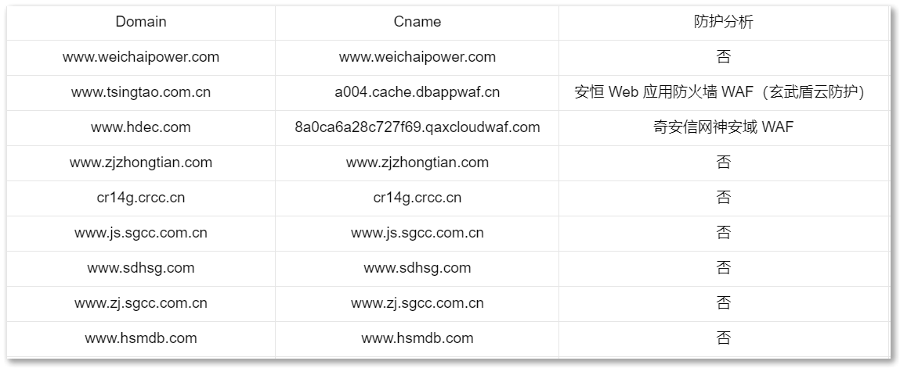

# 域名防护分析脚本使用说明

## 简介
该脚本用于执行域名的防护分析和 CNAME 解析，并生成相应的 Excel 报告。它可识别通过 CNAME 接入 WAF、CDN 的情况。

该脚本目前无法识别其他接入 WAF 的方式，如SDK、特定 IP 接入等。

|      | CDN                                                | WAF                                                    |
| ---- | -------------------------------------------------- | ------------------------------------------------------ |
| 数量 | 35条                                               | 11条左右                                               |
| 说明 | Akamai CDN（阿卡迈）、阿里云 CDN、Cloudflare CDN…… | 华为云 、腾讯云、安恒、奇安信、知道创宇等 WAF 防护情况 |

## 使用前准备
1. 确保安装了 Python 3.x 环境。
2. 安装所需的依赖库：`xlwt`, `openpyxl`。

```bash
# 安装库
pip install xlwt openpyxl
```

## 使用步骤
1. 准备相关文件和信息：

   - 创建名为 "防护关键词-V2.0.xlsx" 的 Excel 文件，包含关键词和节点信息。

   - 创建名为 "domains.txt" 的文本文件，包含待分析的域名列表。

2. 运行脚本
2. 运行后，脚本将开始分析域名信息，并生成名为 "是否存在防护.xlsx" 的 Excel 报告文件。

## 注意事项

- 如果出现域名无法解析的情况，报告中会显示相应的错误信息。
- 确保输入的文件名和路径正确，否则可能导致脚本无法正常执行。

## 免责声明

此脚本仅供参考和个人使用，作者不对因使用此脚本而产生的任何直接或间接损失负责。

如有任何疑问或建议，请联系作者。

## 参考

```bash
# 放入domains.txt中，待分析的域名列表

www.weichaipower.com
www.tsingtao.com.cn
www.hdec.com
www.zjzhongtian.com
cr14g.crcc.cn
www.js.sgcc.com.cn
www.sdhsg.com
www.zj.sgcc.com.cn
www.hsmdb.com
```



<center style="color:#C0C0C0;text-decoration:underline">执行脚本，生成是否存在防护.xlsx</center>
